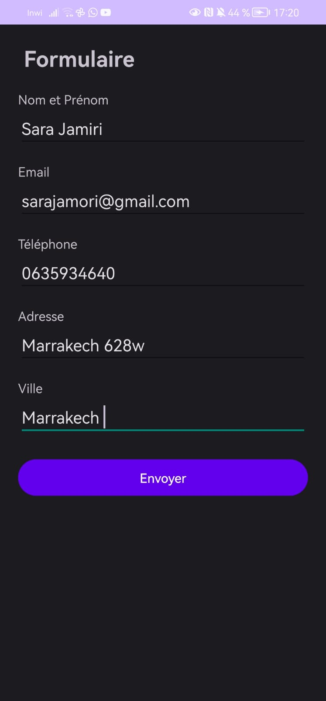
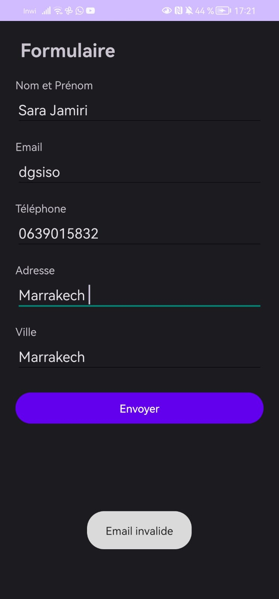
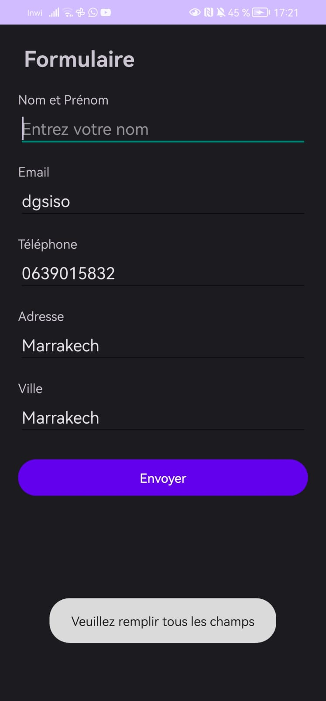

# 📱LAB 3 – Formulaire et navigation

##  Objectif
Créer un formulaire et naviguer vers un écran de récapitulatif.

---

### Page 1 : Formulaire

---

### Page 2 : Récapitulatif

---

###  Validation Email

---

### Vérification des champs

---

##  Fonctionnalités
- Saisie des informations   
- Navigation entre activités 
- Validation email 
- Vérification des champs   

---

##  Exécution
Application testée sur téléphone réel via USB Debugging.

---
